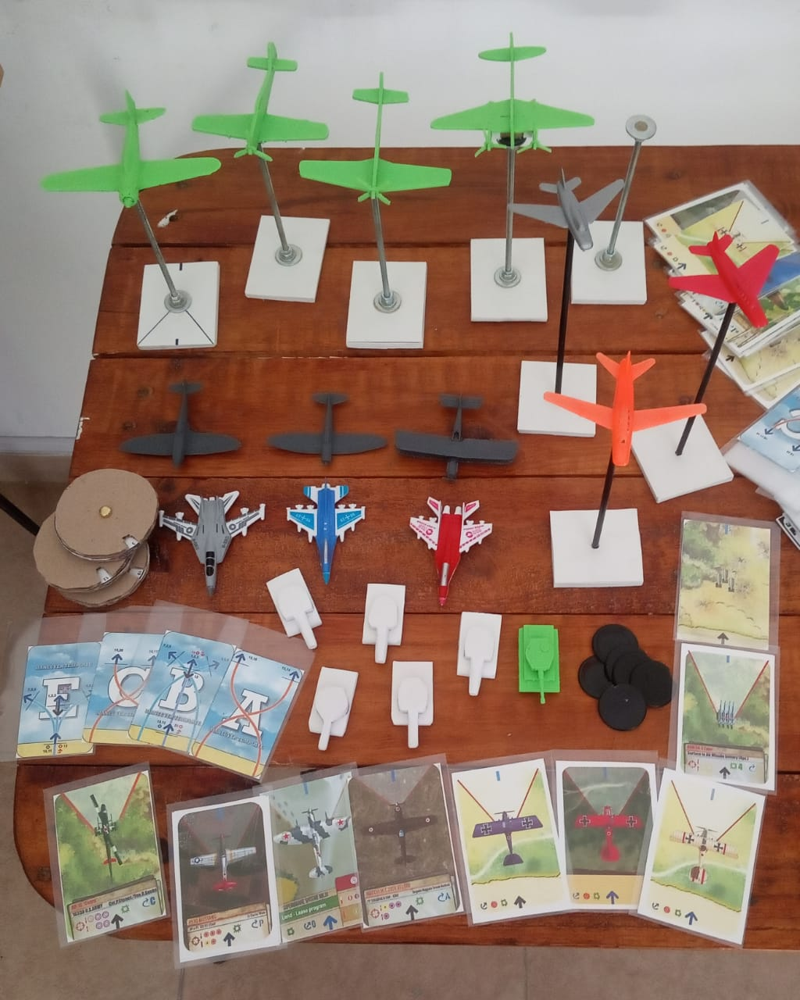
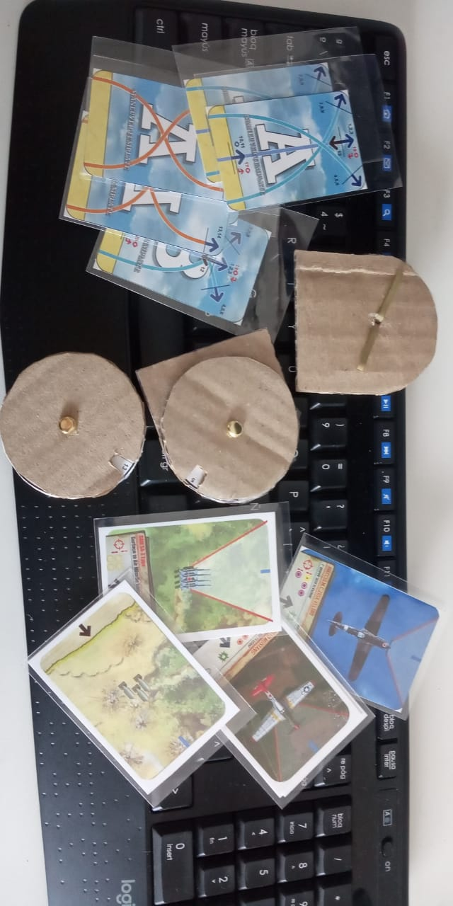

# Wings of Glory   (Juego de mesa)
Fork del famoso juego de mesa Wings of Glory. (hecho en casa)

En Argentina esta complicado conseguir el juego y las miniaturas, por tal motivo realice algunas modificaciones en la mecánica del juego que, si bien no modifican el juego real, benefician en la creación y jugabilidad del mismo.

Las modificaciones realizadas en la mecánica del juego permiten:
 - Minimizar la cantidad de cartas y tokens.
 - Uso de dados para definir daños.
 - Reutilización de objetos (dados, cartas, tokens, etc).
 - Calculos menos agresivos (podes subir los puntos de daño si queres liquidar a tus enemigos más rápido)
 - Maniobras extras
 - Reducción de costo general del juego.
 - Incluí las imágenes de aviones para imprimir en papel.
 - Opcional: Modelos para imprimir con una impresora 3D (aviones + tanques)
 - Incluido Dockerfile para la "app" de daños (si no tienen dados buildeen la imagen)  
 
 

### Miniaturas (3d Print) + Juguetes + cartas impresas en papel.

La escala original es de : 1/72 - 25mm a 28mm   -   Yo los hice de 45mm a 55mm
 

### Tokens de plastico (A mano, con un cartel de la calle)

 

### Cartas impresas en gramaje 150g y diales (contadores) de cartón (una caja de vinos)

 

### Bases y soportes para minis

Las bases pequeñas miden 50mm x 55mm
 

# Resultado final   :) 

 

  

# Para jugar rapido y sin vueltas.
Imprimir lo siguiente:
* [Cartas de aviones](https://github.com/jpradoar/WoG/blob/main/00-Print-to-play/Cartas-01.pdf)
* [Cartas de giros](https://github.com/jpradoar/WoG/blob/main/00-Print-to-play/Cartas-02.pdf)
* [Tablero de jugador](https://github.com/jpradoar/WoG/blob/main/00-Print-to-play/WoG-player-board%20-%20Hoja%201.pdf)
* [Daño y objetivos](Damage_and_objs.md)
* 1 dado de 20 caras (si no tenes podes usar cualquier app de dados.)
* Las miniaturas no son necesarias (podes jugar re bien con las cartas) pero es mas cool si tenes las minis.

  
### Copyright y fuentes de informaciòn
Todos los datos fueron recopilados de los siguientes sitios. 

- https://www.wingsofwar.org/forums/forum.php
- https://www.aresgames.eu/games/ww1-wings-of-glory-line
- https://www.facebook.com/WingsOfGloryMiniatureGame/

