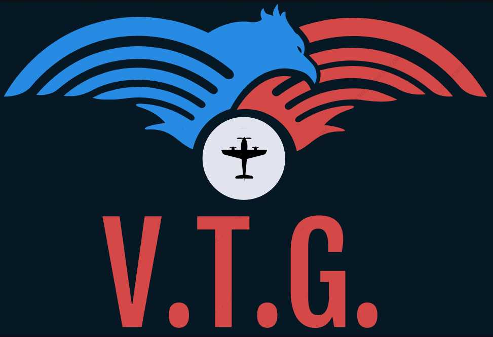

# VUELO TÁCTICO DE GUERRA (V.T.G.)

### VTG es un juego de mesa abierto a la comunidad basado en "Wings of Glory" 

 

En Argentina es complicado (casi imposible) conseguir el juego y las miniaturas, por tal motivo decidi realizar una version "Abierta y replicable" con algunas modificaciones que, si bien no modifican el juego en si, benefician en la creación y jugabilidad del mismo.

Las modificaciones realizadas en la mecánica del juego permiten:
 - Minimizar la cantidad de cartas y tokens.
 - Uso de tokens para definir daños.
 - Reutilización de objetos (dados, cartas, tokens, etc).
 - Calculos menos agresivos (podes subir los puntos de daño si queres liquidar a tus enemigos más rápido)
 - Maniobras extras
 - Reducción de costo general del juego.
 - Incluí las imágenes de aviones para imprimir en papel.
 - Opcional: Modelos para imprimir con una impresora 3D (aviones + tanques)
 
 - No son necesarias las miniaturas, pero es mas lindo si estan. 
 Algunas son impresas en 3D, otras pequeños juguetes de plástico y hay también hechas con broches + basura reciclada y pintada. 
 

### Miniaturas (3d Print) + Juguetes + cartas impresas en papel.

La escala es de 45mm a 55mm, pero si es un poco mas pequeño mejor. Las bases son de 50mm x 45mm
 

 

### Tokens para imprimir

Los podes imprimir de tamaño A4
 

 
 

### Movimientos, bases, tokens y contadores
    
 

 

# Resultado final y prueba de concepto  (v0.1-beta)
 

  

### Bonus

...Y si te aburre las batallas clásicas solo con aviones, podes armar tus propios monstruos para la batalla!!! (momento bizarro)

 
  
  
  
  

  

# Para jugar rapido y sin vueltas.
Imprimir lo siguiente:
* [Reglas](rules.md)
* [Cartas de aviones](https://github.com/jpradoar/WoG/blob/main/00-Print-to-play/Cartas-01.pdf)
* [Cartas de giros](https://github.com/jpradoar/WoG/blob/main/00-Print-to-play/Cartas-02.pdf)
* [Tablero de jugador](https://github.com/jpradoar/WoG/blob/main/00-Print-to-play/WoG-player-board%20-%20Hoja%201.pdf)
* 1 dado de 6 caras (si no tenes podes usar cualquier app de dados.)
* Las miniaturas no son necesarias (podes jugar re bien con las cartas) pero es mas cool si tenes las minis.

  
### Copyright y fuentes de informaciòn
Todos los datos fueron recopilados de los siguientes sitios. 

- https://www.wingsofwar.org/forums/forum.php
- https://www.aresgames.eu/games/ww1-wings-of-glory-line
- https://www.facebook.com/WingsOfGloryMiniatureGame/

