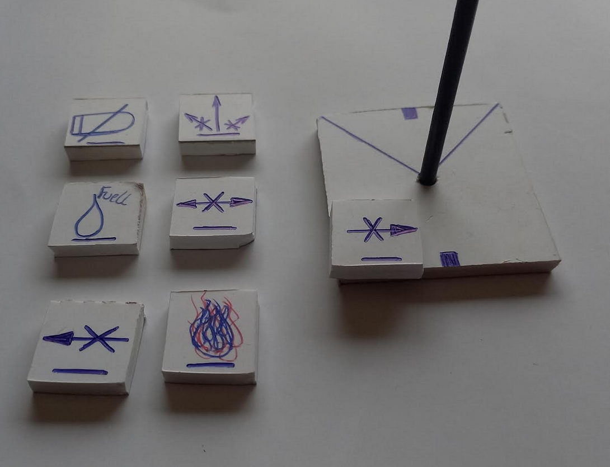

### VUELO TÁCTICO DE GUERRA (V.T.G.)

Vuelo táctico de guerra (VTG) es un juego de guerra de miniaturas de combate para 2-10 jugadores. Cuando se combinan algunas miniaturas, una regla (o cinta métrica), una serie de cartas y algunos dados, este libro de reglas proporciona todo lo que necesitas para jugar a emocionantes y tensas partidas de exploración y combate. 

Crea tus propias estrategias, forma alianzas, destruye bases enemigas, o bien eliminar a tus oponentes sin más! y demuestra que tienes lo necesario para dominar los cielos!!!  

### QUÉ NECESITAS
 

|Nombre: | Detalle| 
|---     | ---    |
|Unidades| (Miniaturas o cartas) Necesitarás por lo menos 2 unidades por jugador, pueden ser miniaturas o bien cartas de unidades. |
|Dados   | Necesitas 1 dado de 6 caras (1D6) |
|Marcador de maniobras| Se utilizan para marcar el estado de una situación o futura acción posible |
|Tokens de daños| para definir los aciertos o fallas |
|Contador| Indicador de posiciones a mover. |
|Regla de rango| Distancia de ataque al oponente (puedes usar una regla de 20cm) |
</pre> 

 

### CONFIGURACIÓN DEL JUEGO

 

<pre>
POSICIONES
• Se plantea una superficie plana de 1x1 mts.  
• Cada jugador elige una carta de unidad y la coloca frente a él (esta sera solo para llevar el control de salud).
• Cada jugador elige sus unidades y las coloca (frente a él) a 1 cm del borde del mapa 
• Puedes moverte por cualquier lugar dentro de los límites del mapa
• No puedes colocar tu unidad a menos de 2 reglas de distancia de tu oponente. 
• Si sales del límite del mapa estarás automáticamente destruido. 
• Puedes chocar con los objetos que hay en el mapa (naves enemigas, aliadas, u objetos en el espacio).

UNIDADES 
• Altura: La altura en la cual se puede mover.
• Tipo de movimiento: (Letra) movimiento posible en cada jugada.
• Salud: El numero de puntos de vida que tiene la unidad.
• Combustible: La cantidad total restante para movilizarse.
• Capacidad de carga: Cantidad de objetos extra que puede cargar. 
</pre>

 

### SECUENCIA DE JUEGO

 

### FASE DE MOVIMIENTO
<pre>
1. Los jugadores seleccionan sus unidades a mover junto con sus cartas de movimiento.
2. Todos los jugadores colocan los contadores con el número de movimiento boca abajo a un lado de su unidad.
3. Todos los jugadores al mismo tiempo dan vuelta sus contadores, colocan la carta de movimiento frente a la base y mueven la la unidad. 
</pre>

### FASE DE ATAQUE
<pre>
Luego de la fase de movimiento podría ocurrir que una o varias unidades pudieran estar “en rango” de ataque. 

A) Si alguna unidad está en rango (si la regla toca la base de la unidad enemiga) esta puede disparar.  
B) Si varias unidades están en rango todas pueden disparar al mismo tiempo.
C) El jugador que indica el ataque debe tirar los dados para ver si acierta el disparo.    Dado: 1D6   ( 1-3 falla, 4-6 acierta)
D) Si una unidad (aliada o enemiga) está en la línea de fuego no podrá disparar al objetivo detrás de ella. En el caso que dispares recibirá daño la primer unidad que esté en la línea de tu regla de rango. 

</pre>

### FASE DE DAÑO

<pre>
1 Si el jugador que dispara, acierta, el jugador o unidad objetivo (jugador que recibe el daño) debera tomar un token de daño.

2. Algunos disparos tienen daño colateral que pueden generar algún tipo de daño o falla extra, para lo cual, deberas colocar un "MARCADOR DE MANIOBRA" en la base de tu unidad. 
EJ: 
    A) El jugador contrario acierta sobre ti.  Tomas un token de daño y lo dejas boca abajo sobre la carta de tu unidad. 
    B) Si el token de daño tambien tiene un "daño colateral" que impide realizar maniobras de giro a la derecha. Tomas "marcador de maniobra" lo colcas boca abajo sobre la base de tu unidad. 
    C) En la fase de movimiento de tu próximo turno deberás dar vuelta el "marcador de maniobra" junto con tu contador de movimiento. 
    D) Una vez finalizado el turno podrás quitar el "marcador de maniobra").

3. Al finalizar todas las fases, todos los jugadores deberan descontar al menos 1 punto de Combustible.

4. Después de completar la Fase de daños finaliza la ronda. Comprueba si alguno de los jugadores ha ganado. 
El jugador gana si todas las unidades enemigas fueron destruidas. 
</pre>

 

### MOVIMIENTOS

Los movimientos de la unidad se realizan a través de “cartas de movimiento” Estas tienen letras para indicar que tipo de maniobra puede realizar tu unidad y números indicadores para el movimiento. cualquiera de los numeros que estan al final de cada flecha es el que deberás colocar en tu contador antes de iniciar la etapa de movimiento. 

En la carta también verás un indicador de posición inicial y final, que deberán coincidir con el indicador de posición de la base de tu unidad. 

Colocas la base de tu unidad, en la parte trasera de la carta, y para avanzar la colocas justo delante de la flecha indicadora de posición, alineada con el indicador de la base. 
Recuerda que el contador y el token deben ir boca abajo y solo serán mostrados al momento de ejecutar el movimiento. 
Solo si se encuentra en rango podrás disparar. El rango se mide con la regla desde el medio de tu base hasta la del objetivo, y el abanico de disparo es el que se muestra en la base.

  

  

    

 

### EJEMPLO DE RONDA DE JUEGO (Ciclos)

<pre>
# Ronda-inicial (Posiciones)
    Seleccione las unidades para la batalla
    Seleccione la carta de movimiento para tus unidades.
    Coloque las unidades en posición
    Inicia la partida. 
        Iniciar y finalizar Fase de movimiento.
            Iniciar y finalizar Fase de ataque.
            Iniciar y finalizar Fase de daños.
        Vuelves a Fase de movimiento.

# Ronda-01

### Ciclo-01      
    Debes colocar el contador junto a tu unidad y esperar que todos terminen de colocar sus contadores.
    Das vuelta tu contador, colocas la carta de movimiento y mueves tu unidad. 
    Una vez terminados todos los movimientos pasas a la fase de ataque

### Ciclo-02
    Pasas la fase de movimiento y entras en ataque.
    Chequeas si tanto tú como tus oponentes están en rango de ataque. 
    Si alguno de los jugadores esta en rango, tira los dados para ver si acierta o falla. 
    Si tu oponente acierta, deberas tomar un token de daño.
    
###Ciclo-03
    Imaginando que tomas un token de daño = (1 + TD)
    Tomas el token y lo colocas boca abajo sobra la carta de un unidad.
    Quitas 1 punto de vida a tu unidad y colocas el token de “timón derecho atascado” boca abajo y continúas con la ronda. 
    Quitas 1 punto de combustible.

    En el siguiente turno podrás realizar cualquier movimiento excepto el indicado por el token, es decir, colocas tu contador de movimiento, luego la carta, das vuelta el token y finalmente realizas el movimiento para luego continuar con la fase de ataque y fase de daños. Luego de terminar dicha fase podrás quitar el token.  
    Es posible que en la misma ronda te vuelvan a disparar con daño colateral, así que en el próximo turno quitaras el token actual y colocaras el nuevo token (si es que recibes daño colateral). De lo contrario quedarás limpio de daños colaterales (tokens)

# Ronda-02... 03 ...
  Vuelves a Fase de movimiento…
</pre>

  

### MARCADORES DE MANIOBRA

 

### TOKENS DE DAÑO COLATERAL

 

### DAÑO COLATERAL (referencia)
|	TOKEN	|	DESCRIPCION	|
|	--- 	|	--- 	|
|	TR	|	Atasco timón (Impide realizar maniobras de tipo rojo en el siguiente turno)	|
|	C	|  	Daño tanque de combustible ( Pierde 3 puntos de combustible )	|
|	TD	|	Timón derecha atascado (Impide realizar maniobras de giro en el siguiente turno)	|
|	TI	|	Timón izquierda atascado (Impide realizar maniobras de giro en el siguiente turno)	|
|	GR	|	Timón giro Rojo (Impide realizar maniobras de tipo rojo en el siguiente turno)	|
|	GA	|	Timón giro Azul (Impide realizar maniobras de tipo azul en el siguiente turno)	|
|	F	|	Fuego ( - 1 x 2 resta un punto de daño por dos turnos consecutivos)	|
|	TA	|	Timón atascado (Sólo maniobra recta en el siguiente turno)	|
|	P	|	Daño piloto o artillero (No puede disparar en el próximo turno)	|
|	H	|	Humo (Debe declarar la siguiente maniobras antes de comenzar el próximo turno)	|
|	X	|	Opciona: Boom (Explosion del avion.)	|
|	X	|	Opciona: Daño masivo (Tira dado (1d6), el número que sale es daño puro)	|
